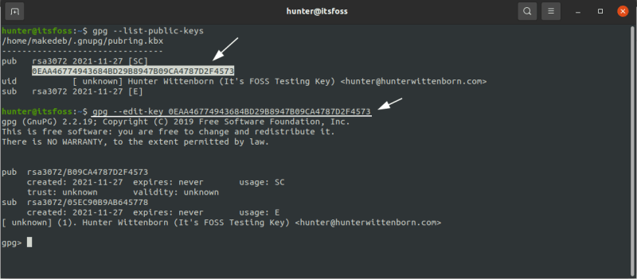
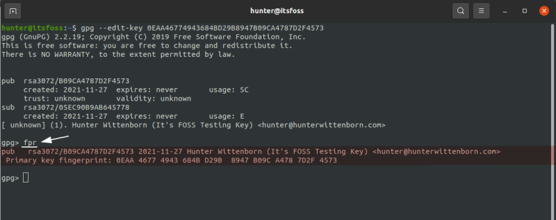
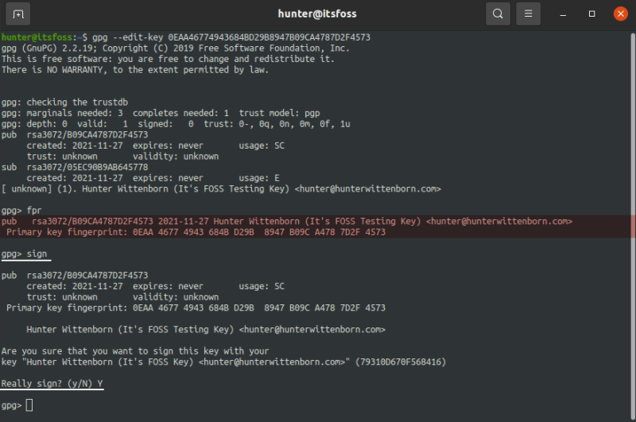

#  gpg

**公钥算法**

**公钥加密算法**，也就是 **非对称加密算法**，这种算法加密和解密的密码不一样，一个是公钥，另一个是私钥：

- 公钥和私钥成对出现
- 公开的密钥叫公钥，只有自己知道的叫私钥
- 用公钥加密的数据只有对应的私钥可以解密
- 用私钥加密的数据只有对应的公钥可以解密
- 如果可以用公钥解密，则必然是对应的私钥加的密
- 如果可以用私钥解密，则必然是对应的公钥加的密

公钥和私钥是相对的，两者本身并没有规定哪一个必须是公钥或私钥。


  下面的命令依据 gpg(GnuPG) 2.2.19

| command                                                      | description                                                  |      |
| ------------------------------------------------------------ | ------------------------------------------------------------ | ---- |
| gpg --list-keys                                              | 密钥列表                                                     |      |
| gpg --list-secret-key                                        | 私钥列表                                                     |      |
| gpg --gen-key <br />gpg --full-generate-key                  | 生成密钥                                                     |      |
| gpg --keyserver hkp://keyserver.ubuntu.com:11371 --send-keys 你的公钥 | 上传公钥                                                     |      |
| gpg --fingerprint [用户ID]                                   | 生成指纹                                                     |      |
| gpg --import [密钥文件]                                      | 导入密钥, 主要是别人的, 用于解密啥的                         |      |
| gpg --keyserver hkp://keyserver.ubuntu.com:11371 --search-keys [用户ID] | 导入密钥, 在服务器上查找别人的公钥, 之后选择数字, 就可以自动导入 |      |
| gpg --local-user [发信者ID或公钥 私钥] --recipient [接收者ID或接收者私钥 公钥]  --armor --sign --encrypt demo.txt | 加密+签名文件, local-user参数指定用发信者的私钥签名，recipient参数指定用接收者的公钥加密 |      |
| gpg --recipient [指定用户ID或邮箱 或者 指定的公钥或私钥, 表示只有这个人能解密此文件] --output demo.en.txt --encrypt demo.txt | 加密文件                                                     |      |
| gpg --output test-de-9y.txt  --decrypt demo.en.txt           | 解密文件, 会自动扫描本机上的私钥,                            |      |
| gpg --armor --output private-key.txt --export-secret-keys    | 导出私钥 --armor选项进行 ASCII 防护                          |      |
| gpg --armor --output public-key.txt --export 用户名或者指定的公钥 | 导出公钥                                                     |      |
| gpg --delete-keys 公钥                                       | 删除公钥                                                     |      |
| gpg --delete-secret-keys 私钥                                | 删除私钥                                                     |      |
| gpg --delete-secret-and-public-key 钥                        | 如果私钥存在的话，会先移除私钥。                             |      |
| gpg  -ab 文件名                                              | 生成文件的签名                                               |      |
| gpg  --verify 签名文件<br />gpg --verify demo.txt.asc demo.txt | 验证签名文件                                                 |      |
| gpg --sign demo.txt                                          | 对文件签名, 以二进制格式压缩、签名和输出签名文本, compresses, signs and outputs the signed text in a binary format. |      |
| gpg --clearsign demo.txt                                     | 生成ASCII码的签名文件, wraps the text in an ASCII-armored signature |      |
| gpg --detach-sign demo.txt                                   | 仅包含签名, 不包含文件内容, the resulting .sig won't contain the signed file only the signature. |      |
|                                                              |                                                              |      |
|                                                              |                                                              |      |
|                                                              |                                                              |      |
|                                                              |                                                              |      |


上传公钥,第一个命令能成功, 有一个成功就行

```shell
gpg --keyserver hkp://keyserver.ubuntu.com:11371 --send-keys 你的公钥
gpg --keyserver hkp://pool.sks-keyservers.net:11371 --send-keys 你的公钥
gpg --keyserver hkp://pgp.mit.edu:11371 --send-keys 你的公钥
```


由于公钥服务器没有检查机制，任何人都可以用你的名义上传公钥，所以没有办法保证服务器上的公钥的可靠性。通常，你可以在网站上公布一个公钥指纹，让其他人核对下载到的公钥是否为真。fingerprint参数生成公钥指纹

```shell
gpg --fingerprint [用户ID]
```


除了生成自己的密钥，还需要将他人的公钥或者你的其他密钥输入系统。这时可以使用import参数。

> 　　gpg --import [密钥文件]

为了获得他人的公钥，可以让对方直接发给你，或者到公钥服务器上寻找。

> 　　gpg --keyserver hkp://keyserver.ubuntu.com:11371 --search-keys [用户ID]

正如前面提到的，我们无法保证服务器上的公钥是否可靠，下载后还需要用其他机制验证．


因为版本问题, 下面的不一定好用

**加密**

假定有一个文本文件demo.txt，怎样对它加密呢？

encrypt参数用于加密。

> 　　gpg --recipient [用户ID] --output demo.en.txt --encrypt demo.txt

recipient参数指定接收者的公钥，output参数指定加密后的文件名，encrypt参数指定源文件。运行上面的命令后，demo.en.txt就是已加密的文件，可以把它发给对方。

**解密**

对方收到加密文件以后，就用自己的私钥解密。

> 　　gpg --decrypt demo.en.txt --output demo.de.txt

decrypt参数指定需要解密的文件，output参数指定解密后生成的文件。运行上面的命令，demo.de.txt就是解密后的文件。

GPG允许省略decrypt参数。

> 　　gpg demo.en.txt

运行上面的命令以后，解密后的文件内容直接显示在标准输出


导出私钥

```shell
gpg --armor --output private-key.txt --export-secret-keys 
```


导出公钥

```shell
gpg --armor --output public-key.txt --export xmliu
```


# gpg --help


```shell
gpg (GnuPG) 2.3.4
libgcrypt 1.9.4
Copyright (C) 2021 g10 Code GmbH
License GNU GPL-3.0-or-later <https://gnu.org/licenses/gpl.html>
This is free software: you are free to change and redistribute it.
There is NO WARRANTY, to the extent permitted by law.

Home: C:\Users\wg\AppData\Roaming\gnupg
Supported algorithms:
Pubkey: RSA, ELG, DSA, ECDH, ECDSA, EDDSA
Cipher: IDEA, 3DES, CAST5, BLOWFISH, AES, AES192, AES256, TWOFISH,
        CAMELLIA128, CAMELLIA192, CAMELLIA256
AEAD: EAX, OCB
Hash: SHA1, RIPEMD160, SHA256, SHA384, SHA512, SHA224
Compression: Uncompressed, ZIP, ZLIB, BZIP2

Syntax: gpg [options] [files]
Sign, check, encrypt or decrypt
Default operation depends on the input data

Commands:

 -s, --sign                         make a signature
     --clear-sign                   make a clear text signature
 -b, --detach-sign                  make a detached signature
 -e, --encrypt                      encrypt data
 -c, --symmetric                    encryption only with symmetric cipher
 -d, --decrypt                      decrypt data (default)
     --verify                       verify a signature
 -k, --list-keys                    list keys
     --list-signatures              list keys and signatures
     --check-signatures             list and check key signatures
     --fingerprint                  list keys and fingerprints
 -K, --list-secret-keys             list secret keys
     --generate-key                 generate a new key pair
     --quick-generate-key           quickly generate a new key pair
     --quick-add-uid                quickly add a new user-id
     --quick-revoke-uid             quickly revoke a user-id
     --quick-set-expire             quickly set a new expiration date
     --full-generate-key            full featured key pair generation
     --generate-revocation          generate a revocation certificate
     --delete-keys                  remove keys from the public keyring
     --delete-secret-keys           remove keys from the secret keyring
     --quick-sign-key               quickly sign a key
     --quick-lsign-key              quickly sign a key locally
     --quick-revoke-sig             quickly revoke a key signature
     --sign-key                     sign a key
     --lsign-key                    sign a key locally
     --edit-key                     sign or edit a key
     --change-passphrase            change a passphrase
     --export                       export keys
     --send-keys                    export keys to a keyserver
     --receive-keys                 import keys from a keyserver
     --search-keys                  search for keys on a keyserver
     --refresh-keys                 update all keys from a keyserver
     --import                       import/merge keys
     --card-status                  print the card status
     --edit-card                    change data on a card
     --change-pin                   change a card's PIN
     --update-trustdb               update the trust database
     --print-md                     print message digests
     --server                       run in server mode
     --tofu-policy VALUE            set the TOFU policy for a key

Options controlling the diagnostic output:
 -v, --verbose                      verbose
 -q, --quiet                        be somewhat more quiet
     --options FILE                 read options from FILE
     --log-file FILE                write server mode logs to FILE

Options controlling the configuration:
     --default-key NAME             use NAME as default secret key
     --encrypt-to NAME              encrypt to user ID NAME as well
     --group SPEC                   set up email aliases
     --openpgp                      use strict OpenPGP behavior
 -n, --dry-run                      do not make any changes
 -i, --interactive                  prompt before overwriting

Options controlling the output:
 -a, --armor                        create ascii armored output
 -o, --output FILE                  write output to FILE
     --textmode                     use canonical text mode
 -z N                               set compress level to N (0 disables)

Options controlling key import and export:
     --auto-key-locate MECHANISMS   use MECHANISMS to locate keys by mail address
     --auto-key-import              import missing key from a signature
     --include-key-block            include the public key in signatures
     --disable-dirmngr              disable all access to the dirmngr

Options to specify keys:
 -r, --recipient USER-ID            encrypt for USER-ID
 -u, --local-user USER-ID           use USER-ID to sign or decrypt

(See the man page for a complete listing of all commands and options)

Examples:

 -se -r Bob [file]          sign and encrypt for user Bob
 --clear-sign [file]        make a clear text signature
 --detach-sign [file]       make a detached signature
 --list-keys [names]        show keys
 --fingerprint [names]      show fingerprints
```


# gpg

1. 安装 

   ```
   sudo apt install gpg
   ```

2. 生成

   ```
   gpg --full-generate-key
   ```

3. 查看

   ```
   gpg --list-keys
   ```

4. 加密  --recipient  boniu-w@live.cn    指定了一个相应的 GPG 密钥的电子邮件

   ```
   gpg --output 加密后的文件名 --encrypt --recipient  boniu-w@live.cn  要加密的文件
   ```

5. 解密

   ```
   gpg --output 解密后的文件名 --decrypt 加密的文件
   ```

6. 导出公钥 ,  公钥id 可用 gpg --list-public-keys 查看

   ```
   gpg --output 导出后公钥的文件名 --export 公钥id
   ```

7. 导入公钥

   ```
   gpg --import 要导入的公钥文件
   ```

   

但要正常使用该密钥，你需要验证该密钥，以便 GPG 正确地信任它。

这可以通过在其他用户的系统上使用 `--edit-key` 参数来完成，然后对密钥进行签名。

首先运行 `gpg --edit-key id`：



GPG 编辑密钥


接下来，使用 `—fpr` 参数，它将显示密钥的指纹。这个命令的输出应该与你自己机器上的输出进行验证，这可以通过在你的系统上运行同样的 `--edit-key` 参数来找到。



GPG 密钥的指纹


如果一切吻合，只需使用 `—sign` 参数，一切就可以开始了。



签署 GPG 密钥


就是这样！其他用户现在可以开始用你的公钥加密文件了，就像你之前做的那样，这可以确保它们只有在你用你的私钥解密时才能被你读取。

这就是使用 GPG 的所有基础知识！